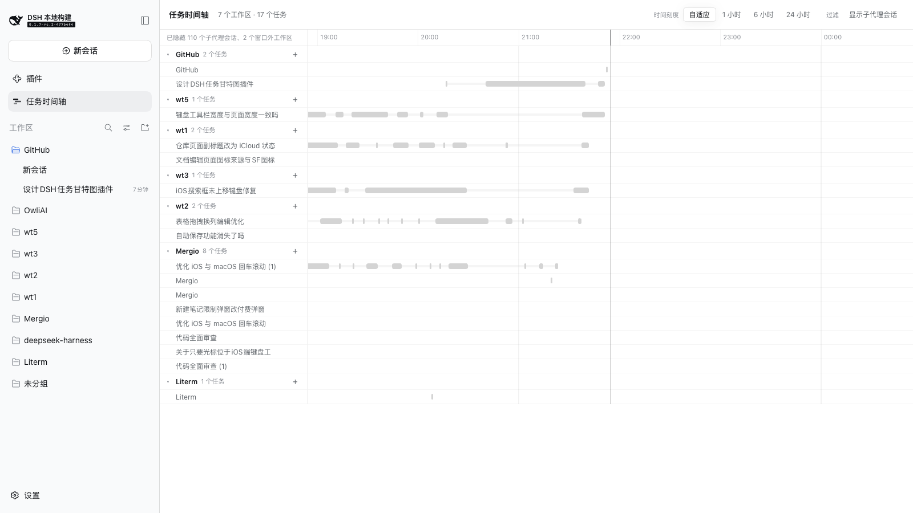

# DSH-Tasks

[English](README.md) | 中文

给 [DeepSeek Harness](https://github.com/deepseek-ai/deepseek-harness) Web GUI 用的甘特式任务时间轴。

在 DSH 里，每个会话就是一个任务。这个面板把每个会话画成横向时间轴上的一行、按工作区分组，让你一眼看到**现在到底有哪些任务在跑、哪些卡在你这里**——而且是跨全部工作区一起看。



## 它显示什么

- **一行一个会话，按工作区分组。** 只有活动落在当前窗口内的会话会出现；窗口外的工作区自动收起。
- **画的是真实工作时段，不是会话年龄。** 一行由会话自身事件日志折叠出的多段区间组成，所以"上午一直在做"的任务就是上午的一串段，而不是一条横跨全天的长条；段下方还有一条淡淡的汇总条表示首尾跨度。
- **六个相位，实时。** `空闲` · `正在生成` · `正在调工具` · `正在等子任务` · `等你审批` · `等你回答`。后两个"等你"的相位才是需要你动手的；正在跑的段右端开口并带呼吸动画。
- **自动时间窗口。** 右端永远是"现在"，窗口长度跟随最近的活动自适应，钳在 15 分钟到 24 小时之间；也可以一键切 1 小时 / 6 小时 / 24 小时。
- **点一下看详情。** 工作区、当前相位、最后活动、最后推进、全部已记录区间及各自时长，外加一个"打开会话"按钮。
- **点工作区就能插入新任务。** 泳道标题上的 `+` 会在该工作区新建会话并把你带到输入框。

## 安装

DSH-Tasks 是一个 bundle：一个包，包含 host 半边和浏览器半边。

**从 GUI 装。** 打开侧边栏的 **插件** 页 → **Add plugin**，填本仓库的 Git 地址或发布后的包名。bundle 成员是在启动时读取的，所以装完需要重启一次 `dsh web` 进程。

**从命令行装。**

```sh
dsh plugin --profile web add github:wwinter117/DSH-Tasks
```

**从本地 checkout 装。** 把 checkout 链进 profile，自己插一行：

```sh
cd ~/.dsh/profiles/web
pnpm add link:/path/to/DSH-Tasks
```

然后往 `~/.dsh/profiles/web/cordis.patch.yml` 追加：

```yaml
- insert:
    - id: task-timeline
      name: 'dsh-tasks'
```

`dsh web` 会监听 profile 的 patch 文件与清单，所以这一行不需要重启就能生效。

其余什么都不用做：页面会随变化同步 client 条目图，所以已打开的页面里侧边栏入口会自己出现。如果没出现，刷新一次页面。

如果面板出现了但每一行都是空的，说明 host 半边还是进程最初导入的那个模块：插件每个进程只导入一次，而同一路径下重建过的 `lib/index.js` 可能被 Node 的 ESM 缓存挡下，这时重启 `dsh web`。**host 半边正常时任务行上会有活动段；陈旧时只有行、没有段。**

## 前置条件

- 一个 DSH web profile（`dsh web`）。host 半边声明依赖 `sessionProjections`，base bundle 一定提供。
- 构建面向 DSH `0.1.7-rc.2` 的客户端模块契约。DSH 公开 API 是 pre-stable 的；升级运行时可能需要同步更新 `tsdown.config.ts` 里的 `PLATFORM_MODULES`。

## 工作原理

一个 npm 包，两个半边，一行 Loader 配置。

**Host 半边**（`src/index.ts`）在 `ctx.sessionProjections` 上注册了一个名为 `dshTasksSpans` 的会话投影。注册表会把折叠逻辑驱动到每个已提交的会话事件上，并把每个对客户端可见的值**随会话列表一起**送到浏览器——冷会话也不例外，走的是持久化投影缓存。这也是第三方 bundle 唯一的推送通道：`ctx.remote.$on()` 只接受第一方白名单，插件无法扩展。

折叠把 5 分钟以内的事件合并成一段，区间数组封顶 96 段，并按最新事件的类型推导相位。它把已发布的开口端量化到 1 秒，并在可见内容没变时复用已发布对象的引用——否则一个流式输出的会话每秒会把会话列表重新发布几十次。

**浏览器半边**（`src/client/`）注册一个 `main` 面板和选中它的 `sidebar.panellist` 入口。两个半边读同一个键：声明合并之所以放在 `src/contract.ts`，正是为了让浏览器半边能给自己的读取定型。

浏览器半边还负责**补齐历史**：在 host 折叠某个会话之前，投影缓存里没有它的行，所以面板会对窗口内、最近活跃但没有值的会话调用 `ctx.sessions.refreshProjections(id)`——每次页面加载每个会话一次。

为什么区间要在 host 侧算、为什么窗口是自适应的、每条决定依赖哪些 DSH 事实：见 [`docs/design.md`](docs/design.md)。

## 已知限制

- **首次打开只显示最近活跃的任务。** 一个会话要有区间数据，必须先被 host 折叠一次。面板会为回溯窗口内的会话请求折叠，所以时间轴是边看边补齐的；闲置超过一天的会话在被动到之前是空的。
- **最后活动时间是秒级精度。** 已发布开口段的末端向下量化到 1 秒网格，这正是让发布保持廉价的原因。
- **"等你"类相位需要客户端在线。** 阻塞中的审批与提问相位来自客户端 UI 状态；光看日志无法把它们和"正在干活"区分开。
- **子代理会话默认隐藏，fork 不隐藏。** fork 本身就是一个独立任务。过滤规则与工作区树自己的 `origin === 'subagent'` 一致。
- **窗口上限 24 小时。** 更长的历史靠打开更早的会话，而不是靠继续拉远。
- **没有虚拟滚动。** 默认过滤加上 24 小时上限把渲染行数控制在几百行以内；要做全历史模式才需要 `@tanstack/react-virtual`。

## 开发

```sh
pnpm install
pnpm run check     # 四个程序的类型检查 + 构建两个半边 + 跑测试
pnpm test          # 63 个测试，其中 6 个直接跑在真实的投影注册表上
pnpm run watch     # 改动即重建
```

浏览器半边是热重载的：`dsh web` 运行时，重建出的 `lib/client.js` 会被 host 的产物轮询发现，面板自己换掉，不需要刷新页面。host 半边不会——见安装一节的重启说明。

`tsdown.config.ts` 里自带一份 DSH 客户端 bundle 预设的拷贝。上游预设位于 DSH checkout 的 `packages/client/tsdown.client.ts`，并未发布，所以仓库之外的插件要自己复刻这份产物契约：`window.__ModuleLoader__.load({ id, factory })` 包装、把平台模块表列为 `external`、以及把 CSS Modules 编译成带标签的 `<style>` 注入。

## 许可证

MIT
